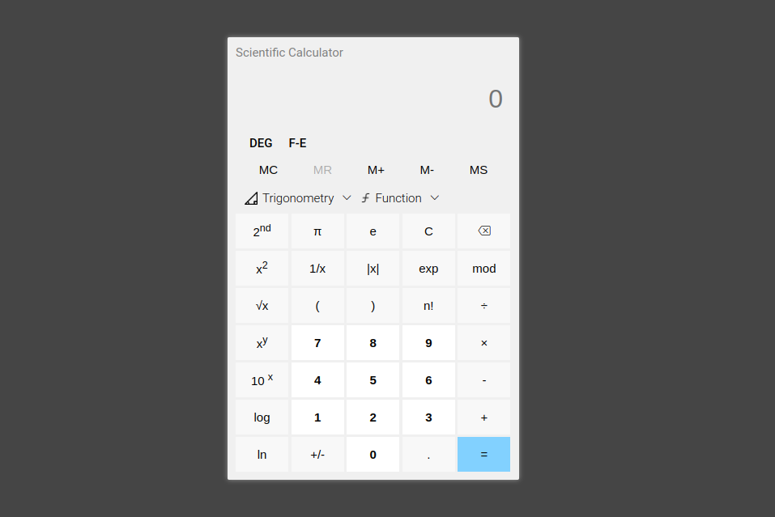

# Scientific Calculator

This is a scientific calculator that can perform various calculations based on user input. It was built using HTML, CSS, and TypeScript.

[deploy Link](https://honey0908.github.io/TS-Calculator/)



## Features

- Basic arithmetic operations: Addition, subtraction, multiplication, and division.
- Square root, cube root exponentiation
- Memory functions: The ability to store and recall values from memory.
- Trigonometric functions: Sine, cosine, tangent, and inverse Trigonometry functions
- Logarithmic functions: Natural logarithm, common logarithm, and exponential.
- Angle modes: The ability to switch between degrees, radians.
- Shows Errors for invalid inputs.

## Usage

To use the calculator, simply open the index.html file in a web browser. You should see the calculator interface with buttons for each of the supported operations.

To perform a calculation, click on the buttons for the numbers and operations you want to use, and then click on the = button to see the result.

## Folder Structure

- dist: This folder contains the compiled JavaScript code generated by the TypeScript compiler.
- src: Contains the TypeScript, HTML, and CSS source code.
- css: Contains the CSS styles.
- images: Contains the images used in the calculator.
- scripts: Contains the TypeScript code for the calculator.
- tsconfig.json: Configuration file for the TypeScript compiler. In this project, we have set the outDir option to the dist folder, which tells the compiler to output the compiled JavaScript files to the dist folder.

```sh
.
├── dist
│   └── index.js
├── index.html
├── README.md
├── src
│   ├── css
│   │   └── style.css
│   ├── images
│   │   ├── calculator.png
│   │   ├── favicon.png
│   │   ├── function.png
│   │   └── trigonometry.png
│   └── scripts
│       └── index.ts
└── tsconfig.json
```
